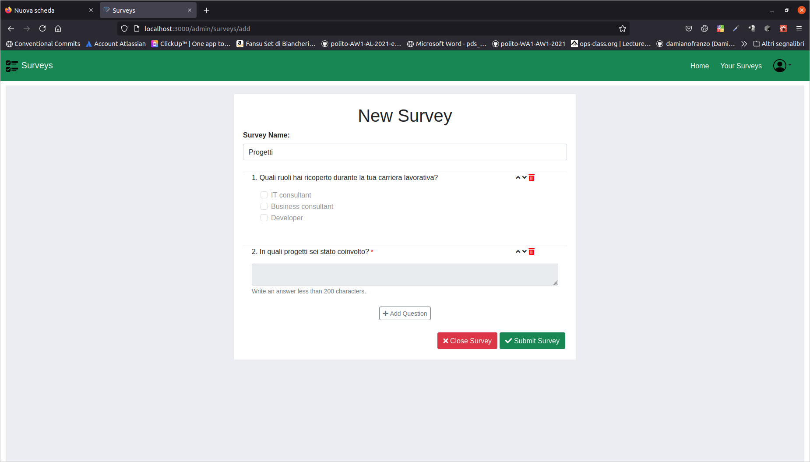

# Exam #1: "Questionario"
## Student: s292537 LETO BENEDETTO 

## React Client Application Routes

- Route `/surveys`: list of all surveys that could be filled out.
- Route `/surveys/:id`: all the questions about a survey identificated by the `id` that could be filled out by the user.
- Route `/login`: admin login.
- Route `/admin/surveys`: list of all surveys that have ben created by the admin.
- Route `/admin/surveys/add`: form used to create a new survey.
- Route `/admin/surveys/:id`: view of all the answers by the user for the survey identificated by the `id`.

## API Server
  - GET `/api/admin/surveys`

    **Description:** Get all the surveys created by the current admin logged in.

    **Request Body:** _None_

    **Success Response:**

      * *Code:* `200 OK` (success)
      
      * *Content:* An array of object, each containing some information about surveys.
        ```
        [
          {
            "id": 46,
            "name": "Auto elettriche",
            "tot_answers": 0
          },
          {
            "id": 47,
            "name": "Criptocurrency",
            "tot_answers": 0
          }
        ]
        ```
    **Error Response:**

    * *Code:* `500 Internal Server Error` (generic error)

       *Content:* An object with error specification.
        ```
        {"error": "Database error."}
        ````
      OR

    * *Code:* `401 Unauthorized`

       *Content:* An object with error specification.
        ````
        { "error": "Not authenticated" }
        ````

  - GET `/api/admin/surveys/:id`

    **Description:** Get the survey identificated by `id`, created by admin logged in.

    **Request Body:** _None_

    **Success Response:**

      * *Code:* `200 OK` (success)

      * *Content:* An object, with some information about the survey.
        ```
        {
          "id": 46,
          "name": "Auto elettriche",
          "questions": [
            {
              "question_text": "Descrivi quali sono secondo te i vantaggi di avere un'auto  elettrica",
              "property": {
                "type": "open-ended",
                "mandatory": true
              },
              "id": 0
            },
            {
              "question_text": "Quali sono secondo te i brand di maggior successo nella produzione di macchine elettriche?",
              "property": {
                "type": "closed-answer",
                "min": "2",
                "max": "4",
                "options": [
                  "FCA",
                  "Tesla",
                  "Ford",
                  "Hunday",
                  "Audi",
                  "BMW",
                  "Rimac"
                ]
              },
              "id": 1
            }
          ]
        }
        ```
    **Error Response:**

    * *Code:* `500 Internal Server Error` (generic error) <br/>
       *Content:* An object with error specification.
        ```
        {"error": "Database error."}
        ````
      OR

     * *Code:* `401 Unauthorized` <br/>
        *Content:* An object with error specification.
        ````
        { "error": "Not authenticated" }
        ````
        OR

     * *Code:* `404 Not Found` <br/>
       *Content:* An object with error specification.

        ````
        { "error": "Survey Not Found" }
        ````

  - POST `/api/admin/surveys`

    **Description:** Add new survey to the list of the admin's surveys.

    **Request Body:** An object rappresenting a new survey.

      * *Content-Type:* `application/json`

        ````
        {
          "name": "Auto elettriche",
          "questions": [
            {
              "question_text": "Descrivi quali sono secondo te i vantaggi di avere un'auto  elettrica",
              "property": {
                "type": "open-ended",
                "mandatory": true
              },
              "id": 0
            },
            {
              "question_text": "Quali sono secondo te i brand di maggior successo nella produzione di macchine elettriche?",
              "property": {
                "type": "closed-answer",
                "min": "2",
                "max": "4",
                "options": [
                  "FCA",
                  "Tesla",
                  "Ford",
                  "Hunday",
                  "Audi",
                  "BMW",
                  "Rimac"
                ]
              },
              "id": 1
            }
          ] 
        }
        ````

    **Success Response:**

      * *Code:* `201 Created` (success)

        *Content:* An object containing id of the last survey added.

        ````
        {"id": 46}
        ````
    **Error Response:**  
     * *Code:* `503 Service Unavailable` (generic error)

       *Content:* 
        ```
        {"error": "Database error during the creation of survey."}
        ````
        OR

     * *Code:* `401 Unauthorized`

       *Content:* 
        ````
        { "error": "Not authenticated" }
        ````
        OR

     * *Code:* `422 Unprocessable Entity` (validation error)

       *Content:* Depends what parameter is wrong.
     
  - GET `/api/surveys`

    **Description:** Get all the surveys.

    **Request Body:** _None_

    **Success Response:** 
     * *Code:* `200 OK` (success)

       *Content:* An array of object, each containing information about surveys.

        ````
        [
          {
            "id": 44,
            "name": "Indagine di mercato",
            "questions": [
              {
                "question_text": "Qual è il prodotto hi-tech che raccomanderesti di più?",
                "property": {
                  "type": "open-ended",
                  "mandatory": true
                },
                "id": 0
              },
              {
                "question_text": "Cosa ti piace di più di questo prodotto?",
                "property": {
                  "type": "open-ended",
                  "mandatory": false
                },
                "id": 1
              },
              {
                "question_text": "Ritieni che il prodotto sia affidabile?",
                "property": {
                  "type": "open-ended",
                  "mandatory": false
                },
                "id": 2
              },
              {
                "question_text": "Cosa secondo te potrebbe essere migliorato?",
                "property": {
                  "type": "closed-answer",
                  "min": "1",
                  "max": "4",
                  "options": [
                    "design",
                    "esperienza utente",
                    "supporto",
                    "dimensioni"
                  ]
                },
                "id": 3
              },
              {
                "question_text": "In che modo il prodotto è stato di aiuto?",
                "property": {
                  "type": "open-ended",
                  "mandatory": false
                },
                "id": 4
              }
            ],
            "tot_answers": 0
          },
          ...
        ]
        ````
    **Error Response:**  
     * *Code:* `500 Internal Server Error` (generic error)

       *Content:* 

          ```
          {"error": "Database error."}
          ````
        OR

     * *Code:* `401 Unauthorized`

       *Content:* 

        ````
        { "error": "Not authenticated" }
        ````
  - GET `/api/survey/:id/answers`

    **Description:** Get all the answers of the survey identificated by the `id`.

    **Request Body:** _None_

    **Success Response:** 
    * *Code:* `200 OK` (success)

      *Content:* An array of object, each containing information about surveys.

        ````
          [
            {
              "id": 58,
              "username": "Ben",
              "id_survey": 46,
              "answers": [
                {
                  "id": 0,
                  "id_question": 0,
                  "answer_text": "Impatto sull'imquinamento ambientale basso e costo di ricarica non elevato"
                },
                {
                  "id": 1,
                  "id_question": 1,
                  "selectedOptions": [
                    true,
                    true,
                    false,
                    false,
                    true,
                    true,
                    false
                  ]
                }
              ]
            }
          ]
        ````
    **Error Response:**

    * *Code:* `500 Internal Server Error` (generic error)

       *Content:* An object with error specification.
        ```
        {"error": "Database error."}
        ````
      OR

     * *Code:* `401 Unauthorized`

       *Content:* An object with error specification.
        ````
        { "error": "Not authenticated" }
        ````
        OR

     * *Code:* `404 Not Found`

       *Content:* An object with error specification.

        ````
        { "error": "Answers not found" }
        ````
  - POST `/api/answers`

    **Description:** Add new answers to the survey. Update partially survey table.

    **Request Body:** An object rappresenting the new answers.

      * *Content-Type:* `application/json`
        ````
        {
          "username": "Ben",
          "id_survey": 46,
          "answers: [
            {
              "id":0,
              "id_question":0,
              "answer_text":"Impatto sull'imquinamento ambientale basso e costo di ricarica non elevato"
            },
            {
              "id":1,
              "id_question":1,
              "selectedOptions":[true,true,false,false,true,true,false]
            }
          ]
        }
        ````

    **Success Response:**

      * *Code:* `201 Created` (success)
        *Content:* An object containing id of the last aswers added.

        ````
        {"id": 58}
        ````
    **Error Response:**  
     * *Code:* `503 Service Unavailable` (generic error)

       *Content:* 
        ```
        {"error": "Database error to fill out survey."}
        ````
       OTHERWISE
        ```
        {"error": "Database error during the update of survey."}
        ````
       OR

     * *Code:* `401 Unauthorized`

       *Content:* 
        ````
        { "error": "Not authenticated" }
        ````
        OR

     * *Code:* `404 Not Found` (wrong survey id)

       *Content:*
        ````
        { "error": "Survey to update not found." }
        ```` 
        OR
    
     * *Code:* `422 Unprocessable Entity` (validation error)

       *Content:* Depends what parameter is wrong.
     
    
## User management

- POST `/api/sessions`

  **Description:** Authenticate the user who is trying to login.

  **Request Body:** Credentials of the user who is trying to login

    ````
    {
      "username": "username",
      "password": "password"
    }
    ````
  **Success Response:**

    * *Code:* `200 OK` (success)
      *Content:* authenticated user

      ````
      {
          "id": 1,
          "username": "james.bond@polito.it", 
          "name": "James Bond"
      }
      ````
  **Error Response:**  
     * *Code:* `500  Internal Server Error` (generic error)

       OR

     * *Code:* `401 Unauthorized` (login faild)

       *Content:* 
        ````
        { "error": "Not authenticated" }
        ````

- GET `/api/sessions/current`

  **Description:** Check if current user is logged in and get her data.

  **Request Body:** _None_

  **Success Response:**

    * *Code:* `200 OK` (success)
      *Content:* authenticated user

      ````
      {
          "id": 1,
          "username": "james.bond@polito.it", 
          "name": "James Bond"
      }
      ````
  **Error Response:**  
     * *Code:* `500  Internal Server Error` (generic error)

       OR

     * *Code:* `401 Unauthorized` (admin is not logged in)

       *Content:* 
        ````
        { "error": "'Unauthenticated user!" }
        ````

- DELETE `/api/sessions/current`

  **Description:** Logout current user

  **Request Body:** _None_

  **Success Response:**
    * *Code:* `200 OK` (success)
     *Content:* _None_
  
  **Error Response:**  
     * *Code:* `500  Internal Server Error` (generic error)

       OR

     * *Code:* `401 Unauthorized` (admin is not logged in)

       *Content:* 
        ````
        { "error": "'Unauthenticated user!" }
        ````

## Database Tables

- Table `admins` - all the information about the admins that create the surveys.

  * structure:

    | id | email | name | password |

- Table `surveys` - all the information about surveys, included questions.

  * structure:

    | id | name | questions | tot_answers | id_admin |

- Table `answers` - all the information about answers given by the users.
  * structure:
  
    | id | username | id_surveys | answers |

## Main React Components

- `LoginComponent` (in `App.js`): Allows admin to login in his dashboard.
- `SurveyFillComponent` (in `App.js`): Contains different Route where user can choose and fill out one of the surveys.
- `SurveyFillOut` (in `SurveyFill.js`): Show questions to fill out of the selected survey.
- `ShowSurveys` (in `SurveyFill.js`): Shows a list of the published surveys that could be filled out.
- `SurveyCreateComponent` (in `App.js`): Contains different Route where admin can create a new survey, visualise his surveys and visualise each answers for each survey.
- `SurveyForm` (in `Survey.js`): Admin could create a new survey.
- `SurveyGroup` (in `Survey.js`): List of the surveys created by the user logged in.
- `ViewAnswers` (in `Survey.js`): Admin can visualise all the answers of one survey.
- `NavbarComponent` (in `App.js`): Shows an header and if the admin is logged in, it shows his information.
- `SearchBarComponent` (in `Survey.js`): Allows admin to find his surveys by name.

## Screenshot


## Users Credentials

- username: james.bond@polito.it, password: password 
- username: black.jack@polito.it, password: password